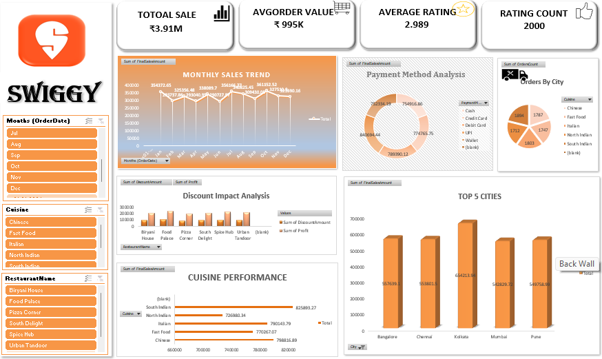

# 🍔 Swiggy Sales Dashboard | Microsoft Excel

## 📌 Project Overview

The **Swiggy Sales Dashboard** is an interactive Microsoft Excel dashboard designed to analyze and visualize food delivery sales performance. The dashboard transforms raw sales data into meaningful insights, enabling users to monitor business performance, customer purchasing behavior, restaurant performance, and regional sales trends through dynamic visualizations.

This project demonstrates the use of Excel's advanced data analysis and visualization capabilities to support data-driven business decisions.

## 🎯 Objectives

* Analyze overall sales and order performance.
* Identify top-performing restaurants and food categories.
* Monitor customer ordering patterns.
* Compare sales across cities and regions.
* Track monthly sales trends and business growth.
* Support strategic decision-making through interactive reports.

## 📊 Key Performance Indicators (KPIs)

* Total Revenue
* Total Orders
* Average Order Value (AOV)
* Total Customers
* Top Selling Categories
* Top Performing Restaurants
* City-wise Sales
* Monthly Sales Trend

## 📈 Dashboard Features

* Interactive slicers and filters
* Dynamic KPI cards
* Sales trend analysis
* Category-wise performance
* Restaurant performance comparison
* City-wise sales visualization
* Customer insights
* Professional and user-friendly dashboard layout

## 🛠 Tools & Technologies

* Microsoft Excel
* Pivot Tables
* Pivot Charts
* Slicers
* Conditional Formatting
* Data Validation
* Excel Formulas

## 💡 Business Insights

* Identifies the highest revenue-generating cities and restaurants.
* Highlights top-selling food categories and customer preferences.
* Tracks monthly sales performance and order trends.
* Supports business decisions through clear and interactive visualizations.
* Helps identify growth opportunities and improve operational performance.

## ⭐ Skills Demonstrated

* Data Analysis
* Data Cleaning
* Dashboard Design
* Business Intelligence
* Data Visualization
* Excel Reporting
* Analytical Thinking
* KPI Analysis
* Data Storytelling

## Dashboard Preview

